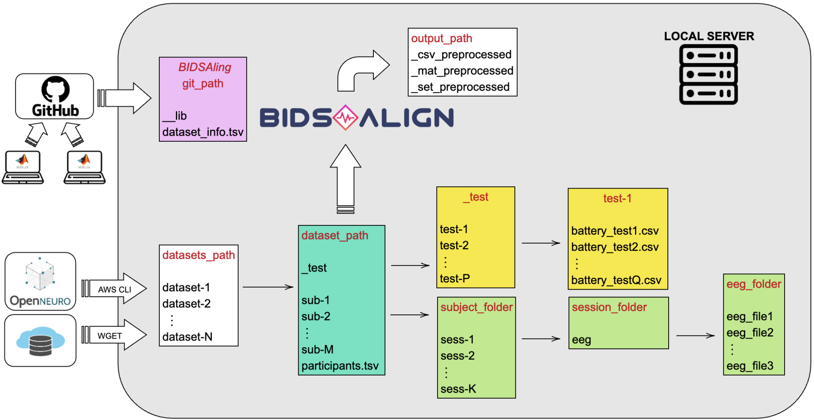

## What can you do?
The library can load, preprocess, and align EEG recordings to a common template, i.e. a set of ordered channels. Each file of the selected datasets will have the same channels, even if data 
comes from different channel systems, with different numbers of electrodes.
The preprocessed and template-aligned files can then be imported and used in Deep Learning frameworks such as PyTorch thus, BIDSAlign is thought to be used as an initial step in a deep-learning project involving EEG data.


Channel systems currently supported are:
- HydroCel Geodesic Sensor Net (128,129,256,257 channels).
- Standard 10-20, 10-10, 10-5 systems (up to 344 channels).


It comes with a dedicated GUI, please see the attached detailed documentation.

## Preparation Steps
In order to successfully use BIDSAlign, check the following steps.

### Datasets List
You have to create a folder where you will store all the datasets present in the DATASET_INFO.tsv file, which is structured in the following way:
| dataset_number_reference | dataset_name     | dataset_code | channel_location_filename | channel_system | channel_reference | channel_to_remove | eeg_file_extension | samp_rate |
|--------------------------|------------------|--------------|---------------------------|----------------|-------------------|-------------------|--------------------|-----------|
| 1                        | HBN_EO_EC        | ds004186     | loaded                    | GSN129         | CZ                |                   | .set               | 500       |
| 2                        | Test_Retest_Rest | ds004148     |                           | 10_10          | FCZ               |                   | .vhdr              | 500       |

The library already comes with all the information needed for 20 public dataset.

Please remember that the name of the folder where the dataset is stored must corresponds to th value in column *dataset_code*. 

### BIDS Format
This library can preprocess datasets structured with both BIDS and non-BIDS format. Thus is expected in input a dataset structured as shown in [BIDS-EEG](https://bids-specification.readthedocs.io/en/stable/modality-specific-files/electroencephalography.html).
However you can use the function *create_dataset_architecture.m* to change in-place the folder structure of the dataset.
As specified by the BIDS format, *participants.tsv* is recommended and should be stored in the dataset folder.

Here an example of how the folder structure and the workflow can be organized.



### Channel Location
Many times the channel location is absent or even wrong when downloading public data. BIDSAlign helps you, by setting the column *channel_location_filename*, in the following way,:
- If a specific channel location should be used for the entire dataset, please enter the filename.
- If the eeg files have already the channel coordinates inside the EEG structure, please enter 'loaded'.
- If the default channel location can be used for the dataset, please enter 'default' and it will use the default channel locations present in EEGLAB.
- If no channel location is specified and the field is left empty, than *_electrodes.tsv* files are searched and eventually used.

## Usage Modalities
You can use the library in three ways:
1. Preprocess a specified file.
You have to specify the dataset name, from which the file is taken, the filename and the corresponding filepath. The modality is activated with the variable *single_file*.
```
single_file = true;
dataset_name = ['UC_SD'];
raw_filename = ['sub-hc10_ses-hc_task-rest_eeg.bdf']; 
raw_filepath = ['/Users/.../Datasets/ds002778/sub-hc10/ses-hc/eeg/'];
```
2. Preprocess an entire dataset.
You have to specify the dataset. In this case you can process the entire dataset, a portion, only some subjects or some sessions, or even preprocess specific groups and/or specific task.
```
single_file = false;
dataset_name = ['UC_SD'];
```
3. Preprocess all the datasets contained in DATASET_INFO.tsv
You have to left empty the dataset name and set single file as false.
```
single_file = false;
dataset_name = [];
```

## Preprocessing
In the current version of the library, the following preprocessing steps are available:
1. Channels removal.
2. Segment removal (first and last specified seconds).
3. Baseline removal.
4. Resampling.
5. Filtering.
6. Independent Component Analysis (ICA) and Automatic IC rejection with MARA or ICLabel.
7. Artifact Subspace Reconstruction (ASR) can be used independently in two ways: for removing bad channels and/or for removing/reconstructing bad time windows.
8. Interpolation of previously removed bad channels.
8. Rereference.

Please note that EEG data are assumed to be saved in $\mu V$.

## Saving and Visualisation
BIDSAlign allows you to do a proper visualisation of the data and perform statistical analysis. 
In order to use the visualisation functions, please save the .set or the .mat folders by specifing save_info.set_label as *group* _ *pipeline*; for example group could be 'A' indicating Alzheimer's and pipeline could be 'ICA' indicating that you have performed Independent Component Analysis, thus *A_ICA*.


The library comes with three functions:
1. groups_visualization: you can compare more groups for a single pipeline, or viceversa; you can also specify the single filename to be visualised.
2. ERP_visualization: you can plot the average and grand-average ERP for a group of patients, for multiple events. If there is only one event, scalp topographies of channels activation in time are also shown.
3. template_comparison: you can see the differences between the topographies obtained from two channel location and the effects of the conversion file. 

## Compatibility
The library was written in MATLAB 2023b, EEGLAB 2023.0, and requires the following plug-in:
- "Biosig" v3.8.3
- "FastICA" v25
- "Fileio" v20240111
- "ICLabel" v1.4
- "MARA" v1.2
- "bva-io" v1.73
- "clean_rawdata" v2.91
- "dipfit" v5.3
- "firfilt" v2.7.1
- "eegstats" v1.2

Moreover interally it uses two functions:
- For the non-parametric permutation t-test [hfASDmodules: Reorganization of functionally connected subnetworks in autism](https://zenodo.org/records/44657).
- For the iaf calculation: [restingIAF](https://zenodo.org/records/2575868)

If you want to avoid downloading these additional packages, please set paf=false and test_parametric=true when using the visualisation function groups_visualization.

## Contributors:
* M.Sc. Andrea Zanola
* Eng. Federico Del Pup
* Prof. Camillo Porcaro
* Prof. Manfredo Atzori


