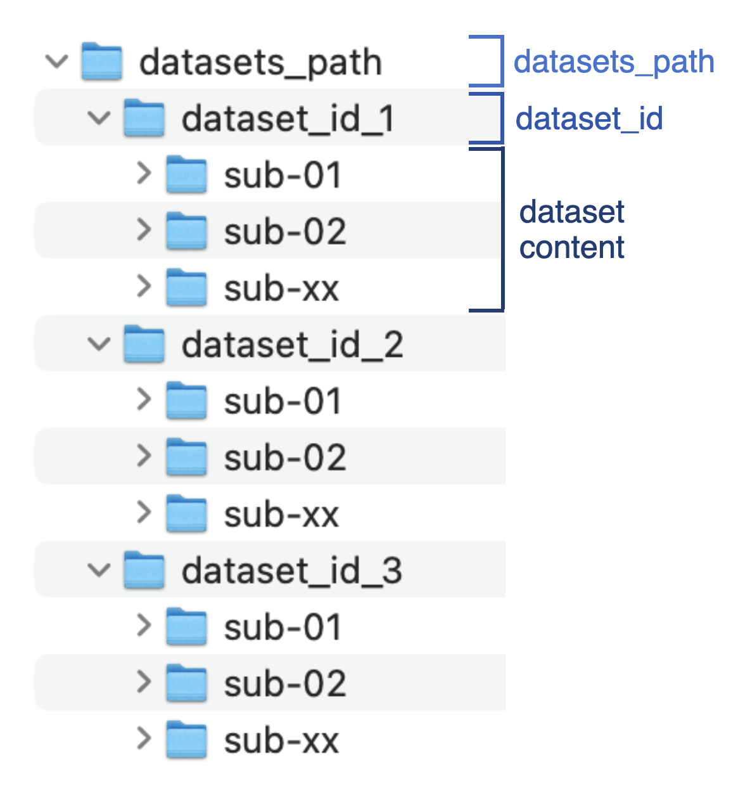

## Index

* [Brief description](#Brief-description)
* [Set up BIDSAlign](#Set-up-BIDSAlign)
  * [Dataset info table](#Dataset-Table)
  * [Path info struct](#Path-info)
  * [Preprocessing info struct](#Preprocessing-info)
  * [Selection info struct](#Selection-info)
  * [Save info struct](#Save-info)
* [Preprocessing modalities](#Preprocessing-modalities)

## Brief description 

BIDSAlign is an eeglab-based library developed to preprocess and align multiple datasets stored in BIDS format. It is designed to be easy to use but at the same time highly customizable. With BIDSAlign you can:

1. preprocess **multiple datasets** in a single run, also exploiting the power of the Matlab's parallel computing toolbox;
2. preprocess a **single dataset**;
3. preprocess a **single file** inside a BIDS dataset.

In addition, you can select a subset of files based on customizable criteria. This is particularly useful if someone want to perform your analysis only on a specific group of subjects, for example healthy or pathologic.

BIDSAlign comes with a GUI created to facilitate the preprocessing configuration for researcher not familiar with direct coding. However, things can also be run directly via scripts. In particular, BIDSAlign offers a guided script useful when working with remote servers, and a basic script to complete with your desired settings. 

Let's see what BIDSAlign needs to properly run.

## Set up BIDSAlign

BIDSAlign revolves around 5 main components: 1 table and 4 struct variables. In particular:

- **Dataset info table**: the dataset table is essential to help BIDSAlign locate EEG files and coordinate some preprocessing steps;
- **Path info struct**: a struct variable that stores a set of path necessary to run the preprocessing pipeline;
- **Preprocesing info struct**: a struct variable that stores all the preprocessing parameters as well as the pipeline to perform;
- **Selection info struct**: a struct variable that stores all the information necessary to select a specific subset of data;
- **Save info struct**: a struct variable that specify in which format preprocessed files must be saved.


### Dataset Table

The dataset table is a table file having the necessary information to locate EEG files and coordinate some preprocessing steps. It must have the following format.

| dataset_number_reference | dataset_name     | dataset_code | channel_location_filename | nose_direction | channel_system | channel_reference | channel_to_remove | eeg_file_extension | samp_rate |
|-------|-------|-------|-------|-------|-------|-------|-------|-------|-------|
| 1 | HBN_EO_EC | ds004186 | loaded | +Y | GSN129 | CZ |  Fp1, Fpz | .set | 500 | 
| This number will be used as first index in the .mat file names | Use this custom label for single dataset mode | The dataset folder name | name of a custom channel location file different from the usual "_electrode.tsv" file | noise direction (+/- X/Y/Z) | 10_5/10/20 or GSN129/257 | Channel reference name | List of channels to directly remove from all the dataset's files | EEG file extension (don't forget the ".") | Sampling rate in \[Hz\] |

Suggested file format are .tsv, .csv, or any other file which can be correctly loaded with the following command. 

```
dataset_info = readtable(dataset_info_filename, ...
    'format','%f%s%s%s%s%s%s%s%s%f','filetype','text');
```

See how all columns have string values except for the first and last, which have numeric values. If you don't know if your file is correct written, You can copy paste our example file and modify it. There is also the function `check_loaded_table` which can check if the table is formatted in the right way.

Going even further, here is a detailed description of the expected values each column should have:

1. **dataset_number_reference (required)**: integer value specifying the dataset id. It is simply an integer you must choose to allow BIDSAlign create the proper name for the .mat preprocessed files. Remember that .mat files have the name "\{dataset_id\}\_\{subject_id\}\_\{session_id\}\_\{object_id\}.mat", with each ID is a number retrieved automatically from the BIDS structure, except for dataset_id which is exactly the dataset_number_reference.
2. **dataset_name (required)**: string specifying a custom acronym for the dataset. It can be any name, as long as multiple datasets do not have the same one. This information is used when you have a table with information of multiple datasets but you want to preprocess only a single one. This can be done by giving the dataset_name as selector.
3. **dataset_code (required)**: The folder name where the dataset is stored. For example, if you download data from OpenNeuro, the dataset is stored inside a folder with name "dsxxxxxx" (x are numbers), which is exactly the dataset_code. 
4. **channel_location_filename (optional)**: the name of a custom file which stores the dataset's EEG channel location. Usually this information is stored in *_electrodes.tsv* files that are mandatory for datasets stored in BIDS format. BIDSAlign is designed to automatically find such files. However, you can set the file name in case for particular needs. If the channel location is stored directly inside the EEG files, add the value "loaded" to this column. 
5. **nose_direction (otpional)**: the nose direction. It can be any combination of +/- X/Y/Z (e.g., +Y). This information can generally be found in the README or in the channel_coordinates json files. 
6. **channel_system (required)**: The channel system name. It can be any between 10_5, 10_10, 10_20, GSN129, GSN257.
7. **channel_reference (required)**: the channel reference. It can be any channel or "COMMON" if the reference is common average 
8. **channel_to_remove (optional)**: a list of channels ro remove. It can be used if a dataset is known to have the same bad channels across all records. BIDSAlign will automatically remove them at the beginning of the preprocessing.
9. **eeg_file_extension**: the file extension used to store EEG files (e.g., .edf, .bdf, .set). It will be used by BIDSAlign to locate the sepcific file inside the 'eeg' folders. Currently supported file extensions are: .vhdr, .set and other extension which can be loaded with the Biosig plug-in with the command `pop_biosig( 'filename' )` 
10. **samp_rate**: The sampling rate reported in Hz (samples per second).


### Path info

Path info is a struct variable that stores all the important paths necessary to run the preprocessing correctly. BIDSAlign requires at least the path to the dataset root folder to be set. The path to eeglab must also be given if not already added to the current search path (you can also simply run `addpath( /path/to/eeglab/ )`). 

In particular, the following paths can be set (all parameters are char arrays):

1. **datasets_path (required)**: the path to the root datasets folder. BIDSAlign will use it as the starting point during the preprocessing file search. In particular, BIDSAlign will look for any subfolder with name equal to the *dataset_code* entry of the dataset info table. The following image will better explaing what BIDSAlign assumes to be the datasets_path.


2. **output_path (required)**: the root path used by BIDSAlign to save all the preprocessed files. By default, BIDSAlign will use the current working directory (the output of the `pwd` command). Inside the output path, BIDSAlign will create a set of folders that will be used to store files of specific format. For example, the *_mat_preprocessed* folder will store all the .mat files. The following behaviour will be bypassed if custom output paths (the next elements of the list) will be set.
3. **output_mat_path (optional)**: a custom path to be used by BIDSALign to store the .mat files. It will be used in place of the `output_path/_mat_preprocessed/` folder.
4. **output_set_path (optional)**: a custom path to be used by BIDSALign to store the .set files. It will be used in place of the `output_path/_set_preprocessed/` folder.
5. **output_csv_path (optional)**: a custom path to be used by BIDSALign to store the marker files. It will be used in place of the `output_path/_csv_preprocessed/` folder.
6. **eeglab_path (optional)**: the path to the eeglab folder. It can be left empty if eeglab is already included in your search path. As an alternative.
7. **diagnostic_folder_name (optional)**: the name of a folder with extra diagnostic tests to be included together with preprocessed EEGs in the .mat files. This is a particular option potentially useful for those who wants to include a specific test directly in the stored file to be used as label in future AI projects.
8. **raw_filepath (optional)**: the path to a specific file to be preprocessed in single file mode. It is useful for those who want to perform tests with a specific file and do not want to input the filename/filepath every time.

Path info stores other information that are useful but can be automatically retrieved by BIDSAlign itself. Such information are the path to BIDSAlign functions and the current working directory.

### Preprocessing info

Preprocessing info is a struct variable that stores all the parameters to use during the preprocessing phase. Default values were chosen to produce good results overall but, depending on the investigated subjects and task involved, some tuning might be more appropriate. BIDSAlign performs a rich automated pipeline that comprises baseline removal, filtering, bad channel removal, IC rejection, ASR and rereferencing. All these steps can be skipped, leaving to the user the choice of what operations BIDSAlign should automate. See this figure to understand the overall pipeline.


In particular, the following preprocessing parameters can be set:

1) Segment Removal phase

- **dt_i (scalar)**: the number of seconds to remove from the start of each EEG. Must be a positive scalar. Default is 0;
- **dt_f (scalar)**: the number of seconds to remove before the end of each EEG. Must be a positive scalar. Default is 0;

2) Resampling phase

- **sampling_rate (scalar)**: the sampling rate to use for resampling, given in Hz. Must be a positive scalar. Default is 250 Hz;

3) Filtering phase

- **low_freq (scalar)**: the low-pass filter frequency of the bandpass filter, given in Hz. Must be a positive scalar. Default is 0.1 Hz;
- **high_freq (scalar)**: the high-pass filter frequency of the bandpass filter, given in Hz. must be a positive scalar. Default is 49 Hz;

4) IC rejection phase

- **ic_rej_type ('mara'|'iclabel')**: the indipendent component rejection algorithm to use. MARA rejects component based on a binary Support Vector Machine classifier, ICLabel rejects component based on a multi-class classification deep neural model. Default is iclabel. -- Note -- for linux and mac user an extra dependency must be installed to allow faster computation.
- **iclabel_thresholds (7x2 scalar array)**: an array with probabilities range used for the component rejection. See the iclabel help for further information. Basically the iclabel model returns a set probabilities evaluating a component to be in one of the iclabel classification categories (brain, eye, muscle, heart, line noise, channel noise, other). Based on the given intervals and the calculated probabilities, a component is rejected or not. Default is \[0 0; 0.9 1; 0.9 1;  0.9 1;  0.9 1;  0.9 1;  0.9 1\];
- **mara_threshold (scalar)**: the minimum calculated probability necessary to reject a component. Must be a scalar in range \[0, 1\]. Default is 0.5;


5) Channel correction phase

(descriptions were taken from [clean_artifact function](https://github.com/sccn/clean_rawdata/blob/master/clean_artifacts) of the Clean_rawdata EEGLAB plug-in)

- **flatlineC (scalar)**: flatline criterion. Maximum tolerated flatline duration, given in seconds. If a channel has a longer flatline than this, it will be considered abnormal. Must be a positive scalar. Default is 5;
- **ChannelC (scalar)**: channel criterion. Minimum channel correlation. If a channel is correlated at less than this value to a reconstruction of it based on other channels, it is considered abnormal in the given time window. This method requires that channel locations are available and roughly correct; otherwise a fallback criterion will be used. Must be a scalar in range \[0, 1\]. Default is 0.8;
- **lineC (scalar)**: line noise criterion. If a channel has more line noise relative to its signal than this value, in standard deviations based on the total channel population, it is considered abnormal. Must be a positive scalar Default is 4; 

6) Windows removal phase (activated by th_reject)

- **th_reject (scalar)** Window Removal phase threshold, given in microVolt. If the EEG signal after the channel correction still has values outside 
- **windowC (scalar)**: Window Criterion. Criterion for removing time windows that were not repaired completely. This may happen if the artifact in a window was composed of too many simultaneous uncorrelated sources (for example, extreme movements such as jumps). This is the maximum fraction of contaminated channels that are tolerated in the final output data for each considered window. Generally a lower value makes the criterion more aggressive. Default: 0.25. Reasonable range: 0.05 (very aggressive) to 0.3 (very lax). Must be a scalar value lower than 1. Default is 0.25;
- **burstC (scalar)** Burst Critetion. Standard deviation cutoff for removal of bursts (via ASR). Data portions whose variance is larger than this threshold relative to the calibration data are considered missing data and will be removed. The most aggressive value that can be used without losing much EEG is 3. For new users it is recommended to at first visually inspect the difference between the original and cleaned data to get a sense of the removed content at various levels. An agressive value is 5 and a quite conservative value is 20. Default:- (from the GUI, default is 20).
- **burstR ('on'|'off')**: Burst Rejection. If 'on', reject portions of data containing burst instead of correcting them. Default is 'on';

7) Channel interpolation phase

- **interpol_method('spherical'|'spacetime')**: the channel interpolation method to use. Channel interpolation is called after the channel correction if during that phase channel were removed as bad channels, or if a set of channels were asked to be removed since the start of the preprocessing phase; 

8) Rereferencing phase

- **standard_ref ('char')**: the new reference to use during rereferencing. Must be a char array. Allowed inputs are 'COMMON' or any other specific EEG channel name available in the 10_X or GSN_X systems. Default is 'COMMON'."

9) IC decomposition

- **ica_type ('fastica'|'runica')**: the type of ica decomposition to use. Remember that fastica requires the fastICA package to run. Be sure to install it in your environment. Default is 'fastica'.
- **non_linearity('tanh'|'pow3'|'gauss'|'skew')**: the type of non linearity to use during IC computation with fastICA algorithm. Default is 'tanh'.
- **n_ica (scalar)**: the number of Component to extract (if possible). If set to 0, the possible maximum number of components is computed. Default is 20.

10) Pipeline setting

- **rmchannels (logical)**: whether to perform channel removal or not. Channels removed are those specified in the channel_to_remove column of the dataset info table. Default is true.
- **rmsegments (logical)**: whether to permorm segment removal or not. Default is true.
- **rmbaseline (logical)**: whether to perform baseline removal or not. Default is true.
- **resampling (logical)** whether to perform resampling or not. Default is true.
- **filtering (logical)**: whether to perform filtering or not. Default is true.
- **ICrejection (logical)**: whether to perform the automatic indipendent component rejection or not. During this phase, indipendent component decomposition is performed to get the set of components to reject. Default is false.
- **ASR (logical)**: whether to perform automatic artifact rejection and Artifact Subspace Reconstruction (ASR) or not. In the pipeline this phase includes the channel correction and windows removal. Windows removal is performed only if the channel reconstruction fails to provide an EEG with values in the range set with `th_reject`. Default is false.
- **rereference (logical)**: whether to perform rereferencing or not. Default is true.
- **ICA (logical)**: whether to perform IC Decomposition or not. This step is performed at the end of the preprocessing to provide the set of components of the preprocessed EEG (ICs calculated before the rejection phase can be deleted during rereferencing). Default is false.

### Selection info

Selection info is a struct variable that stores all the parameters to be used by BIDSAlign during the file selection phase. Selection can be perfomed with three different modalities: label-based selection, name-based selection, slice-based selection. 

1) **label-based selection** is a type of selection which search for all the subjects with a specific condition reported in one of the columns of the `participant.tsv` file. It can be used, for example, to select only subject with a specific pathology (or the control group).
2) **name-based selection** is a type of selection which search for all the subjects, sessions, or objects, with a specific substring included in the level folder name. It is performed **after the label-based selection**. For example, the string 'ses1' can be used to select only the first session from all the subjects in a dataset.
3) **slice-based selection** is a type of selection performed which iterate over a slice of the extracted EEG file names to preprocess at the subject-, session-, or object- level. It is performed **after the label- and name-based selections**. For example, a slice of 2-5 at the subject level will select the remaining subjects with index from 2 to 5 in the list extracted after the first two selections. Index here means the position in the array with all the remaining suject- session- or objects- names 

In particular, the following selection parameters can be set (defaults are all empty):

0. selection performed:

- **select_subjects (logical)**: whether to perform any type of selection or not. Default is false. 

2. label-based selection

- **label_name (char)**: the column name of the participant file to look for the desired value.
- **label_value (char)**: the column value that a subject should have to be selected. Currently, only string values are supported.

2. name-based selection

- **subjects_totake (cell array)**: a name part that a folder at the subject level must include in its name to be selected. Search is performed by looking at the output of the Matlab's `contain` function. Must be a cell array. Multiple parts can be included. In such a case, at least one of the given parts must be included in the subject's folder name.
- **session_totake (cell array)**: a name part that a folder at the session level must include in its name to be selected. Search is performed by looking at the output of the Matlab's `contain` function. Must be a cell array. Multiple parts can be included. In such a case, at least one of the given parts must be included in the session's folder name.
- **task_totake (cell array)**: a name part that a folder at the task/object level must include in its name to be selected. Search is performed by looking at the output of the Matlab's `contain` function. Must be a cell array. Multiple parts can be included. In such a case, at least one of the given parts must be included in the file name.
   
3. slice-based selection

- **sub_i (scalar)**: slice's starting index for subject selection. Must be a positive scalar integer. If left empty and sub_f is given, sub_i is set to 1 automatically.
- **sub_f (scalar)**: slice's ending index for subject selection. Must be a positive scalar integer. If left empty and sub_i is given, sub_f is set to the length of the subject's name list automatically.
- **ses_i (scalar)**: slice's starting index for session selection. Must be a positive scalar integer. If left empty and ses_f is given, ses_i is set to 1 automatically.
- **ses_f (scalar)**: slice's ending index for session selection. Must be a positive scalar integer. If left empty and ses_i is given, ses_f is set to the length of the session's name list automatically.
- **obj_i (scalar)**: slice's starting index for object selection. Must be a positive scalar integer. If left empty and obj_f is given, obj_i is set to 1 automatically.
- **obj_f (scalar)**: slice's ending index for object selection. Must be a positive scalar integer. If left empty and obj_f is given, obj_i is set to the length of the object's name list automatically.

### Save info

Save info is a struct variable tells BIDSAlign what, how, and in which format preprocessed files should be saved.

In particular, the following saving options are available:

1. **save_data (logical)**: wheter to save preprocessed as .mat files or not. Default is true.
2. **save_data_as ('matrix'|'tensors')**: the array format in wich eeg data are converted for .mat files. Mainly included for deep learning researchers. If matrix, a 2D array with dimensions Channel * Sample is used (typical input of architectures like EEGnet). If tensors, a 3D array with dimensions Channel x Channel x Sample is used (this input is used by some architectures). Tensors format basically reshape the channel dimension in a 2D array similar to the electrode placement seen from above the scalp. Default is 'matrix'.
3. **save_struct (logical)**: whether to include other information in the .mat files and store everything a struct variable. If this is true, save_data will be automatically set to true. Default is false.
4. **save_set (logical)**: whether to store preprocessed EEGs as .set. Default is false.
5. **save_marker(logical)**: whether to save marker files. Default is false.
6. **set_label (char)**: a custom label to add to the dataset ID during the storage of the .set preprocessed files.

## Preprocessing modalities

BIDSAlign can launch three types of preprocessing, making it a valuable tool for different situations.

1) **multi-dataset preprocessing**: in this modality, all the datasets included in the `dataset info table` will be preprocessed with the same specified pipeline. Multi-dataset preprocessing allows datasets to be processed with the Parallel Computing toolbox, speeding up the overall process (each worker will deal with a specific dataset). Remember that all datasets must be included inside the path given with the path_info's `datasets_path` field, and each dataset must be included in the folder with the same name as reported in the table_info's `dataset_id` columnn. See this picture to be sure on how data are expected to be organized.



2) **single-dataset preprocessing**: in this modality, a single dataset can be selected from the `dataset info table` to be preprocessed with the specified pipeline. To enable this modality, you must specify the dataset to preprocess giving the proper label to the `single_dataset_name` argument of the `preprocess_all` function, which is the function you must called (or called by the GUI) to launch the preprocessing. `single_dataset_name` must include the corresponding label given in the `dataset_name` column of the info table. This is an example of a single-dataset preprocessing call.

```
[~] = preprocess_all( /path/to/table/info , 'dataset_name', 'MyBIDSData'); 
```
4) **single-file preprocessing**: in this modality, a single file is preprocessed with the specified pipeline. To enable this modality, you must first set the `single_file` argument of the `preprocess_all` function to true. Then, give the name or path of file to preprocess must be specified using the `single_file_name` argument of the same function. `single_file_name` accept both the sole file name or the complete path. It can also be left empty if the full path was set in the `path_info.raw_filepath` variable. After the note, an example of a suggested single-file preprocessing call is given.

    **_NOTE:_** that if you give only the filename and not the full path to the file, it is STRONGLY suggested to also give the respective dataset name (the one you would give if preprocessing the entire dataset in single-dataset mode). BIDSAlign can automatically detect from which dataset the file come from, but in case of multiple files with the same name (rare but still possible), an error will be thrown  

```
[~] = preprocess_all( /path/to/table/info , ...
                      'dataset_name', 'MyBIDSData', ...
                      'single_file', true, ...
                      'single_file_name', 'MyEEGrecord.bdf'
                    ); 
```


