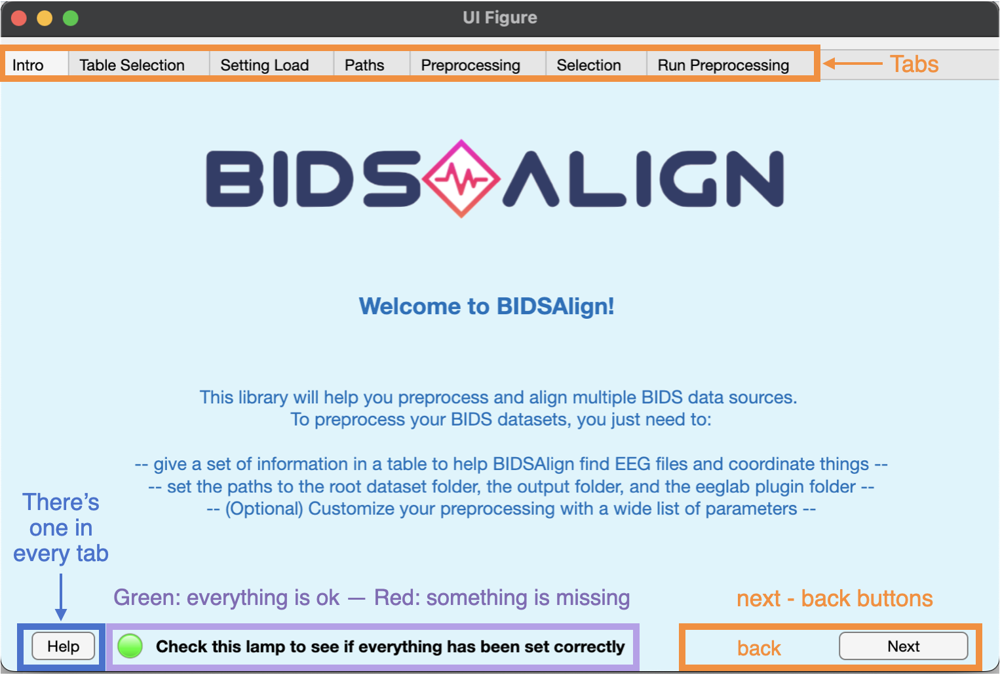

## Welcome to BIDSALign!

BIDSAlign is an eeglab-based library developed to preprocess and align multiple datasets stored in BIDS format. It is designed to be easy to use but at the same time highly customizable. With BIDSAlign you can:

1. preprocess **multiple datasets** in a single run, also exploiting the power of the Matlab's parallel computing toolbox;
2. preprocess a **single dataset**;
3. preprocess a **single file** inside a BIDS dataset.

In addition, you can select a subset of files based on customizable criteria. This is particularly useful if you want to perform your analysis only on a specific group of subjects, for example healthy or pathologic.

As you can see, BIDSAlign comes with a GUI created to facilitate the preprocessing configuration for researcher not familiar with direct coding. However, remember that things can also be run directly via scripts.

## GUI Tab

This tab simply present the BIDSAlign GUI. Nothing can be set here. However, you can see the overall GUI's structure. In particular:

-  orange highilithed components  can be used to navigate through the GUI. Just click on the button or tabs.
-  Mauve highilithed lamp  will always tell you if everything set on the current tab is ok or should be added or changed. Remember that a preprocessing run can be launched only if all the lamps are highlighted in green. This does not guarantee that the preprocessing will go smoothly, but at least it makes sure that common mistakes are avoided.
-  Denim highilithed help button  can be used to open a new window where everything about the parameters to set and the GUI buttons to use is clearly explained.

