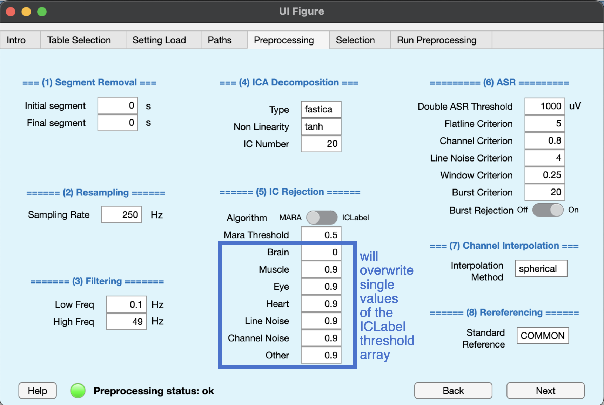

## Preprocessing info

Preprocessing info is a struct variable that stores all the parameters to use during the preprocessing phase. Default values were chosen to produce good results overall but, depending on the investigated subjects and task involved, some tuning might be more appropriate. BIDSAlign performs a rich automated pipeline that comprises baseline removal, filtering, bad channel removal, IC rejection, ASR and rereferencing. All these steps can be skipped, leaving to the user the choice of what operations BIDSAlign should automate. See this figure to understand the overall pipeline.

In particular, the following preprocessing parameters can be set:

1) Segment Removal phase

- **Initial segment (scalar)**: the number of seconds to remove from the start of each EEG. Must be a positive scalar. Default is 0;
- **Final segment (scalar)**: the number of seconds to remove before the end of each EEG. Must be a positive scalar. Default is 0;

2) Resampling phase

- **sampling Rate (scalar)**: the sampling rate to use for resampling, given in Hz. Must be a positive scalar. Default is 250 Hz;

3) Filtering phase

- **Low Freq (scalar)**: the low-pass filter frequency of the bandpass filter, given in Hz. Must be a positive scalar. Default is 0.1 Hz;
- **High Freq (scalar)**: the high-pass filter frequency of the bandpass filter, given in Hz. Must be a positive scalar. Default is 49 Hz;

4) IC rejection phase

- **Agorithm ('mara'|'iclabel')**: the independent component rejection algorithm to use. MARA rejects component based on a binary Support Vector Machine classifier, ICLabel rejects component based on a multi-class classification deep neural model. Default is iclabel. -- Note -- for Linux and Mac users, an extra dependency must be installed to allow faster computation.
- **Brain - Muscle - Eye - Heart - Line Noise - Channel Noise - Others (scalar)**: scalars with probabilities used for the component rejection with ICLabel. See the IClabel help for further information. Basically the iclabel model returns a set of probabilities evaluating a component to be in one of the iclabel classification categories (brain, eye, muscle, heart, line noise, channel noise, other). Based on the given intervals and the calculated probabilities, a component is rejected or not. Basically everything with a calculated probability bigger than the given value will be rejected, aside from brain components which will operate in the opposite direction. Default is \[0 0; 0.9 1; 0.9 1;  0.9 1;  0.9 1;  0.9 1;  0.9 1\];
- **Mara threshold (scalar)**: the minimum calculated probability necessary to reject a component. Must be a scalar in range \[0, 1\]. Default is 0.5;

5) Channel correction phase

(descriptions were taken from [clean_artifact function](https://github.com/sccn/clean_rawdata/blob/master/clean_artifacts) of the Clean_rawdata EEGLAB plug-in)

- **Flatline Criterion (scalar)**: flatline criterion. Maximum tolerated flatline duration, given in seconds. If a channel has a longer flatline than this, it will be considered abnormal. Must be a positive scalar. Default is 5;
- **Channel Criterion (scalar)**: channel criterion. Minimum channel correlation. If a channel is correlated at less than this value to a reconstruction of it based on other channels, it is considered abnormal in the given time window. This method requires that channel locations are available and roughly correct; otherwise a fallback criterion will be used. Must be a scalar in range \[0, 1\]. Default is 0.8;
- **Line Noise Criterion (scalar)**: line noise criterion. If a channel has more line noise relative to its signal than this value, in standard deviations based on the total channel population, it is considered abnormal. Must be a positive scalar. Default is 4; 

6) Windows removal phase (activated by th_reject)

- **Double ASR Threshold (scalar)** Window Removal phase threshold, given in microVolt. If the EEG signal after the channel correction still has values outside 
- **Window Criterion (scalar)**: Window Criterion. Criterion for removing time windows that were not repaired completely. This may happen if the artifact in a window was composed of too many simultaneous uncorrelated sources (for example, extreme movements such as jumps). This is the maximum fraction of contaminated channels that are tolerated in the final output data for each considered window. Generally a lower value makes the criterion more aggressive. Default: 0.25. Reasonable range: 0.05 (very aggressive) to 0.3 (very lax). Must be a scalar value lower than 1. Default is 0.25;
- **Burst Criterion (scalar)** Burst Criterion. Standard deviation cutoff for removal of bursts (via ASR). Data portions whose variance is larger than this threshold relative to the calibration data are considered missing data and will be removed. The most aggressive value that can be used without losing much EEG is 3. For new users, it is recommended to at first visually inspect the difference between the original and cleaned data to get a sense of the removed content at various levels. An aggressive value is 5 and a quite conservative value is 20. Default:- (from the GUI, default is 20).
- **Burst Rejection ('on'|'off')**: Burst Rejection. If 'on', reject portions of data containing burst instead of correcting them. Default is 'on';

7) Channel interpolation phase

- **interpolation Method ('spherical'|'spacetime')**: the channel interpolation method to use. Channel interpolation is called after the channel correction if during that phase channel were removed as bad channels, or if a set of channels were asked to be removed since the start of the preprocessing phase; 

8) Rereferencing phase

- **Standard reference ('char')**: the new reference to use during rereferencing. Must be a char array. Allowed inputs are 'COMMON' or any other specific EEG channel name available in the 10_X or GSN_X systems. Default is 'COMMON'.

9) IC decomposition

- **Type ('fastica'|'runica')**: the type of ica decomposition to use. Remember that fastica requires the fastICA package to run. Be sure to install it in your environment. Default is 'fastica'.
- **Non Linearity('tanh'|'pow3'|'gauss'|'skew')**: the type of non-linearity to use during IC computation with fastICA algorithm. Default is 'tanh'.
- **IC number (scalar)**: the number of Component to extract (if possible). If set to 0, the possible maximum number of components is computed. Default is 20.

## GUI Tab

In this tab, you can set up most of the preprocessing_info's struct fields. Just write the desired value in each edit field. Note that IC rejection thresholds for IClabel are divided to make the array easier to set up. Also, when you choose between MARA or ICLabel, thresholds fields of the opposite algorithm will be disabled.