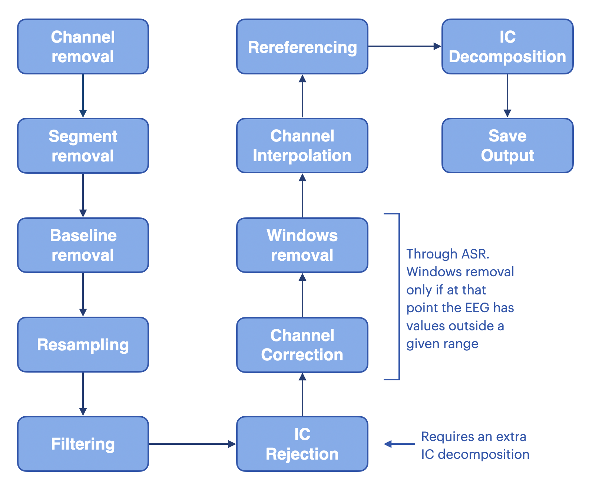
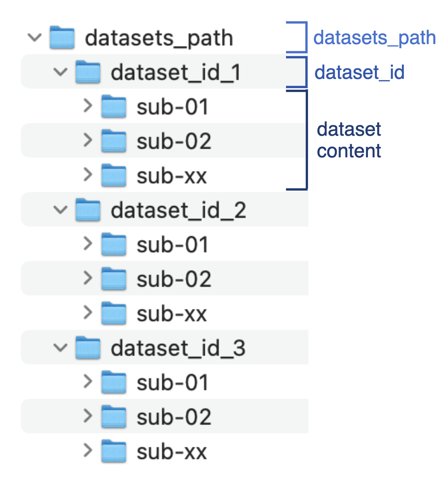
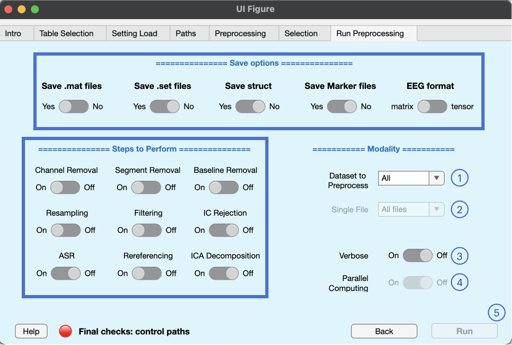

<h1 align="center">
  
</h1><br>

* [Save info](#Save-info)
* [Steps to Perform](#steps-to-Perform)
* [Preprocessing modalities](#Preprocessing-modalities)
* [GUI Tab](#GUI-Tab)

## Save info

Save info is a struct variable telling BIDSAlign what, how, and in which format preprocessed files should be saved.

In particular, the following saving options are available:

1. **Save .mat files (logical)**: whether to save preprocessed as .mat files or not. Default is true.
2. **EEG format ('matrix'|'tensors')**: the array format in wich EEG data are converted for .mat files. Mainly included for deep learning researchers. If matrix, a 2D array with dimensions Channel * Sample is used (typical input of architectures like EEGnet). If tensors, a 3D array with dimensions Channel x Channel x Sample is used (this input is used by some architectures). Tensors format basically reshape the channel dimension in a 2D array similar to the electrode placement seen from above the scalp. Default is 'matrix'.
3. **Save struct (logical)**: whether to include other information in the .mat files and store everything in a struct variable. If this is true, save_data will be automatically set to true. Default is false.
4. **Save .set files (logical)**: whether to store preprocessed EEGs as .set. Default is false.
5. **Save Marker files(logical)**: whether to save marker files. Default is false.

## Steps to Perform

Steps to perform are the boolean fields set in the `preprocessing_info.prep_steps` variable. It can be used to set which steps you would like to perform or not. As a reminder, here is a simple scheme about the BIDSAlign preprocessing pipeline.

<h1 align="center">
  
</h1><br>

- **Channel Removal (logical)**: whether to perform channel removal or not. Channels removed are those specified in the channel_to_remove column of the dataset info table. Default is true.
- **Segment Removal (logical)**: whether to perform segment removal or not. Default is true.
- **Baseline Removal (logical)**: whether to perform baseline removal or not. Default is true.
- **Resampling (logical)** whether to perform resampling or not. Default is true.
- **Filtering (logical)**: whether to perform filtering or not. Default is true.
- **IC Rejection (logical)**: whether to perform the automatic independent component rejection or not. During this phase, independent component decomposition is performed to get the set of components to reject. Default is false.
- **ASR (logical)**: whether to perform automatic artifact rejection and Artifact Subspace Reconstruction (ASR) or not. In the pipeline, this phase includes the channel correction and windows removal. Windows removal is performed only if the channel reconstruction fails to provide an EEG with values in the range set with `th_reject`. Default is false.
- **Rereferencing (logical)**: whether to perform rereferencing or not. Default is true.
- **ICA Decomposition (logical)**: whether to perform IC Decomposition or not. This step is performed at the end of the preprocessing to provide the set of components of the preprocessed EEG (ICs calculated before the rejection phase can be deleted during rereferencing). Default is false.

## Preprocessing modalities

BIDSAlign can launch three types of preprocessing, making it a valuable tool for different situations.

1) **multi-dataset preprocessing**: in this modality, all the datasets included in the `dataset info table` will be preprocessed with the same specified pipeline. Multi-dataset preprocessing allows datasets to be processed with the Parallel Computing toolbox, speeding up the overall process (each worker will deal with a specific dataset). Remember that all datasets must be included inside the path given with the path_info's `datasets_path` field, and each dataset must be included in the folder with the same name as reported in the table_info's `dataset_id` column. See this picture to be sure on how data are expected to be organized.

<h1 align="center">
  
</h1><br>

2) **single-dataset preprocessing**: in this modality, a single dataset can be selected from the `dataset info table` to be preprocessed with the specified pipeline. To enable this modality, you must specify the dataset to preprocess giving the proper label to the `single_dataset_name` argument of the `preprocess_all` function, which is the function you must call (or called by the GUI) to launch the preprocessing. `single_dataset_name` must include the corresponding label given in the `dataset_name` column of the info table. This is an example of a single-dataset preprocessing call.

```
[~] = preprocess_all( /path/to/table/info , 'dataset_name', 'MyBIDSData'); 
```
4) **single-file preprocessing**: in this modality, a single file is preprocessed with the specified pipeline. To enable this modality, you must first set the `single_file` argument of the `preprocess_all` function to true. Then, give the name or path of file to preprocess must be specified using the `single_file_name` argument of the same function. `single_file_name` accept both the sole file name or the complete path. It can also be left empty if the full path was set in the `path_info.raw_filepath` variable. After the note, an example of a suggested single-file preprocessing call is given.

    **_NOTE:_** that if you give only the filename and not the full path to the file, it is STRONGLY suggested to also give the respective dataset name (the one you would give if preprocessing the entire dataset in single-dataset mode). BIDSAlign can automatically detect from which dataset the file come from, but in case of multiple files with the same name (rare but still possible), an error will be thrown  

```
[~] = preprocess_all( /path/to/table/info , ...
                      'dataset_name', 'MyBIDSData', ...
                      'single_file', true, ...
                      'single_file_name', 'MyEEGrecord.bdf'
                    ); 
```

## GUI Tab

<h1 align="center">
  
</h1><br>

This final tab is used to set up all the remaining things and run the preprocessing. In particular:

* **Save options** switches will change values inside the save_info struct variable.
* **Steps to Perform** switches will change values inside the preprocessing_info.prep_steps variable.
1. The **Dataset to Preprocess** dropdown can be used to select a specific dataset to preprocess, thus switching BIDSALign to the single-dataset mode. Once a dataset is selected, the Single File dropdown will be enabled and the list of files updated to let you choose a specific file for the single-file mode. At the same time, the Parallel computing switch will be disabled.
2. The **Single File** dropdown list can be used to select a specific file of the selected dataset to preprocess, thus switching BIDSAlign to the single-file mode.

    **_NOTE_** If you apply changes to the table info or the dataset path stored in path_info, BIDSAlign can be reset to the multi-dataset mode, thus resetting the "Dataset to Preprocess" and the "Single File" values to their default, as shown in the figure above. BIDSAlign will always try to apply your changes without resetting values, but sometimes it's just not possible.

3. The **verbose** switch will set if every message should be print in the command window or caught using the `evalc` function. Errors will still be displayed and will stop the preprocessing.
4. The **Parallel Computing** switch will set if the multi-dataset preprocessing should be run with the parallel computing toolbox (basically a parfor) or not. This switch is enabled only if Dataset to Preprocess is set to all.
5. The **Run** button will run the preprocessing pipeline with the current configuration. This button will be enabled only if everything is ok. The final checks lamp will help you locate parameters that are not configured properly. Note that if the lamp is green, it doesn't mean that your preprocessing will go without errors, but simply that the values are at least set up properly. 