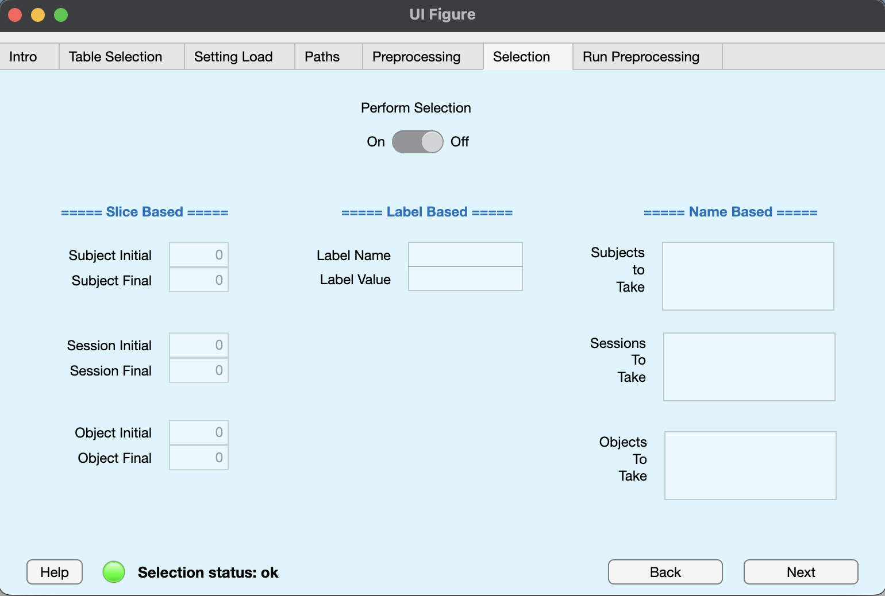

## Selection info

Selection info is a struct variable that stores all the parameters to be used by BIDSAlign during the file selection phase. Selection can be perfomed with three different modalities: label-based selection, name-based selection, slice-based selection. 

1) **label-based selection** is a type of selection which search for all the subjects with a specific condition reported in one of the columns of the `participant.tsv` file. It can be used, for example, to select only subject with a specific pathology (or the control group).
2) **name-based selection** is a type of selection which search for all the subjects, sessions, or objects, with a specific substring included in the level folder name. It is performed **after the label-based selection**. For example, the string 'ses1' can be used to select only the first session from all the subjects in a dataset.
3) **slice-based selection** is a type of selection performed which iterate over a slice of the extracted EEG file names to preprocess at the subject-, session-, or object- level. It is performed **after the label- and name-based selections**. For example, a slice of 2-5 at the subject level will select the remaining subjects with index from 2 to 5 in the list extracted after the first two selections. Index here means the position in the array with all the remaining suject- session- or objects- names 

In particular, the following selection parameters can be set (defaults are all empty):

0. selection performed:

- **Perform Selection (logical)**: whether to perform any type of selection or not. Default is false. 

2. label-based selection

- **Label Name (char)**: the column name of the participant file to look for the desired value.
- **Label Value (char)**: the column value that a subject should have to be selected. Currently, only string values are supported.

2. name-based selection

- **Subjects to Take (cell array)**: a name part that a folder at the subject level must include in its name to be selected. Search is performed by looking at the output of the Matlab's `contain` function. Must be a cell array. Multiple parts can be included. In such a case, at least one of the given parts must be included in the subject's folder name.
- **Sessions to Take (cell array)**: a name part that a folder at the session level must include in its name to be selected. Search is performed by looking at the output of the Matlab's `contain` function. Must be a cell array. Multiple parts can be included. In such a case, at least one of the given parts must be included in the session's folder name.
- **Objects to Take (cell array)**: a name part that a folder at the task/object level must include in its name to be selected. Search is performed by looking at the output of the Matlab's `contain` function. Must be a cell array. Multiple parts can be included. In such a case, at least one of the given parts must be included in the file name.
   
3. slice-based selection

- **Subject Initial (scalar)**: slice's starting index for subject selection. Must be a positive scalar integer. If left empty and sub_f is given, sub_i is set to 1 automatically.
- **Subject Final (scalar)**: slice's ending index for subject selection. Must be a positive scalar integer. If left empty and sub_i is given, sub_f is set to the length of the subject's name list automatically.
- **Session Initial (scalar)**: slice's starting index for session selection. Must be a positive scalar integer. If left empty and ses_f is given, ses_i is set to 1 automatically.
- **Session Final (scalar)**: slice's ending index for session selection. Must be a positive scalar integer. If left empty and ses_i is given, ses_f is set to the length of the session's name list automatically.
- **Object Initial (scalar)**: slice's starting index for object selection. Must be a positive scalar integer. If left empty and obj_f is given, obj_i is set to 1 automatically.
- **Object Final (scalar)**: slice's ending index for object selection. Must be a positive scalar integer. If left empty and obj_f is given, obj_i is set to the length of the object's name list automatically.

## GUI Tab

In this tab, you can set up most of the preprocessing_info's struct fields. In particular, just note that:

- In **slice-based** edit fields the value 0 will be overwritten internally as an empty value. It can be considered as the same as 1 for Initial and 'end' for the Final.
- In **label-based** edit fields, input are kept as char arrays. Support to numeric values will be added in the future.
- In **name-based** edit fields, every name part must be inputed in a new line. DO NOT input more parts in the same line by separating thing with a space or a command, as this will BROKE the selection
- The **perform Selection** can be put to 'On' even if no selection criteria have been configured. However, this will make the current status to bad and the lamp will become red.

