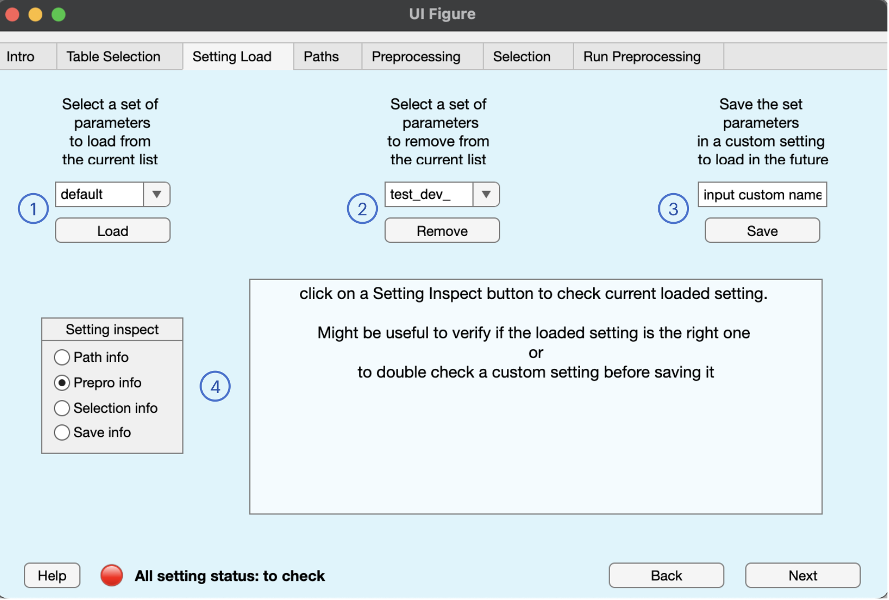

## Manage custom configurations

BIDSAlign allows you to store, load or remove a custom preprocessing configuration. This will help you avoid inputing everything every time you use BIDSAlign. At the function level every `set_X_info` function (X can be 'path', 'preprocessing', 'selection', or 'save') has two parameters that you can use to save the specific struct variable inside a configuration folder. An example of a function call to save a custom set of path is

```
path_info = set_path_info(path_info, ...
                  'store_settings', true, ...
                  'setting_name', 'MyCustomName' ...
);
```

Every configuration file is stored in a subdirectory of the default_setting folder (located inside the __lib folder). Inside such folders, which has a name equals to setting_name, 1 to 4 .mat files will be saved depending on the number of custom configurations you choose to store.

To remove a configuration, just call the `remove_settings` function.

To load the entire or a specific file of an existing configuration, just call the `load_settings` function.


## GUI Tab



In this tab, you can load and remove existing configurations, or save the current one in a new or old setting. In particular looking at the figure above, the following actions can be performed with the numbered buttons:

1. An existing configuration can be loaded by selecting the right setting name with the dropdown component, and then by clicking the **load** button. Note that if a setting does not have a custom configuration for all the 4 main struct variables (path, preprocessing, selection, save), only the loaded ones will be overwritten, leaving the rest untouched (no reset to default). Moreover, if an eeglab path is available in the loaded configuration and the current search path does not have one, BIDSAlign will try to check that the loaded one will make eeglab avalable.
2. An existing setting can be removed by selecting the right setting name with the dropdown component, and then by clicking the **remove** button. Note that if a loaded setting is removed, the current configuration stored by BIDSAlign will not change (no reset to default). Also note that the default setting cannot be removed to avoid strange behaviours. If you have some problems with the default setting, simply run the `reset_default_settings` function.
3. A preprocessing configuration stored in the current BIDSAlign session can be saved by first inputing the setting name in the edit field component and then by clicking the **save** button. Note that bad setting will not be saved. For example, if a configuration is good except for the paths, the rest is saved and the path_info.mat file is ignored.
4. The current preprocessing configuration can be inspected by clicking the proper button in the **setting inspect** button group.

   **_Note_**: to update the inspection box of a particular struct already selected, just select another info and then click again on the desired one
