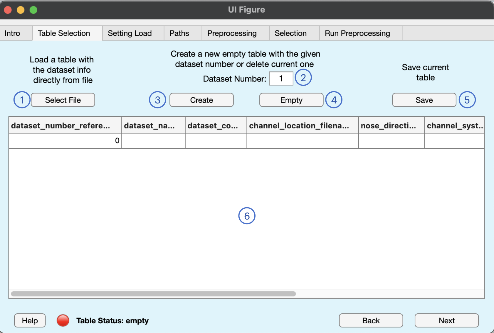
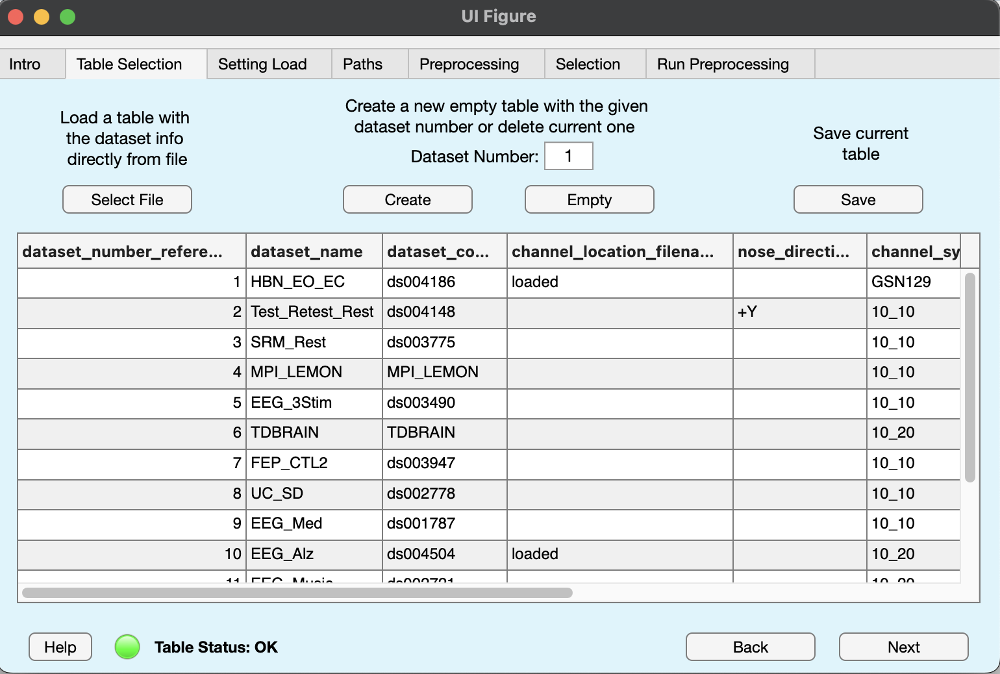

## Dataset Table

The dataset table is a table file having the necessary information to locate EEG files and coordinate some preprocessing steps. It must have the following format.

| dataset_number_reference | dataset_name     | dataset_code | channel_location_filename | nose_direction | channel_system | channel_reference | channel_to_remove | eeg_file_extension | samp_rate |
|-------|-------|-------|-------|-------|-------|-------|-------|-------|-------|
| 1 | HBN_EO_EC | ds004186 | loaded | +Y | GSN129 | CZ |  Fp1, Fpz | .set | 500 | 
| This number will be used as first index in the .mat file names | Use this custom label for single dataset mode | The dataset folder name | name of a custom channel location file different from the usual "_electrode.tsv" file | noise direction (+/- X/Y/Z) | 10_5/10/20 or GSN129/257 | Channel reference name | List of channels to directly remove from all the dataset's files | EEG file extension (don't forget the ".") | Sampling rate in \[Hz\] |

Suggested file format are .tsv, .csv, or any other file which can be correctly loaded with the following command. 

```
dataset_info = readtable(dataset_info_filename, ...
    'format','%f%s%s%s%s%s%s%s%s%f','filetype','text');
```

See how all columns have string values except for the first and last, which have numeric values. If you don't know if your file is correct written, You can copy paste our example file and modify it. There is also the function `check_loaded_table` which can check if the table is formatted in the right way.

Going even further, here is a detailed description of the expected values each column should have:

1. **dataset_number_reference (required)**: integer value specifying the dataset id. It is simply an integer you must choose to allow BIDSAlign create the proper name for the .mat preprocessed files. Remember that .mat files have the name "\{dataset_id\}\_\{subject_id\}\_\{session_id\}\_\{object_id\}.mat", with each ID is a number retrieved automatically from the BIDS structure, except for dataset_id which is exactly the dataset_number_reference.
2. **dataset_name (required)**: string specifying a custom acronym for the dataset. It can be any name, as long as multiple datasets do not have the same one. This information is used when you have a table with information of multiple datasets but you want to preprocess only a single one. This can be done by giving the dataset_name as selector.
3. **dataset_code (required)**: The folder name where the dataset is stored. For example, if you download data from OpenNeuro, the dataset is stored inside a folder with name "dsxxxxxx" (x are numbers), which is exactly the dataset_code. 
4. **channel_location_filename (optional)**: the name of a custom file which stores the dataset's EEG channel location. Usually this information is stored in *_electrodes.tsv* files that are mandatory for datasets stored in BIDS format. BIDSAlign is designed to automatically find such files. However, you can set the file name in case for particular needs. If the channel location is stored directly inside the EEG files, add the value "loaded" to this column. 
5. **nose_direction (otpional)**: the nose direction. It can be any combination of +/- X/Y/Z (e.g., +Y). This information can generally be found in the README or in the channel_coordinates json files. 
6. **channel_system (required)**: The channel system name. It can be any between 10_5, 10_10, 10_20, GSN129, GSN257.
7. **channel_reference (required)**: the channel reference. It can be any channel or "COMMON" if the reference is common average 
8. **channel_to_remove (optional)**: a list of channels ro remove. It can be used if a dataset is known to have the same bad channels across all records. BIDSAlign will automatically remove them at the beginning of the preprocessing.
9. **eeg_file_extension**: the file extension used to store EEG files (e.g., .edf, .bdf, .set). It will be used by BIDSAlign to locate the sepcific file inside the 'eeg' folders. Currently supported file extensions are: .vhdr, .set and other extension which can be loaded with the Biosig plug-in with the command `pop_biosig( 'filename' )` 
10. **samp_rate**: The sampling rate reported in Hz (samples per second).

## GUI Tab



In this tab, you can load, modify, and save the table file with the datasets information. In particular looking at the figure above, the following actions can be performed with the numbered buttons:

1. the **select file** button will open a file selector where you can select a table file to open with the command reported in the previous section.
2. the **Dataset Number** edit field is used to select a number of dataset. Buttons 3 (create) will perform actions based on the number given here. Basically, you need to edit this field when you want to create a new empty table with a specific number of rows or you want to delete or add some rows of the preloaded table.
3. the **Create** button will perform two different actions. If nothing is loaded, then a new empty table with a number rows equals to dataset number is created. If a table was already loaded, a new table with number of rows equal to the given dataset number, but values are assigned by looking at those already available from the loaded table. For example, if you have loaded a table with 10 rows and you click the create button with dataset number set to 5, a new table with only the first five rows of the previously loaded table will be created.
4. the **Empty** button is used to completely delete current table and generate a fresh one. Simply use it to reset everything.
5. the **Save** button will open a new window where you can interactively choose name and path for the current table to save.
6. the **table editor** can be used to modify specific cells of the table. Keep in mind that if a table is in a bad status (red lamp), you can modify everything freely. If the table is in a good status (green lamp), cells modifications that brings the table to a bad status are not allowed.

    **_NOTE_**: If you change some relevant information such as values inside the dataset_name, dataset_code, eeg_file_extension columns, the list of single datasets and single files in the run tab may change, resetting previous selections (if you have selected a dataset and then changed its name, it is obvious that BIDSAlign must forget the previous name). Be sure to select again the proper dataset or file if this happen.

If everything is done correctly, something similar should appear in the tab, depending on the number of dataset set.




